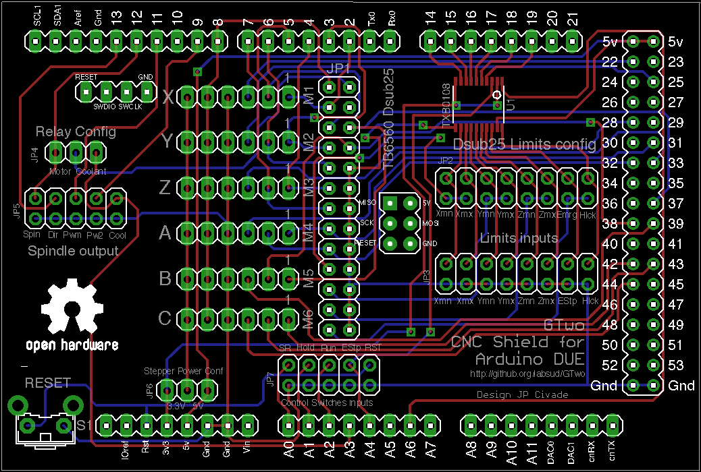
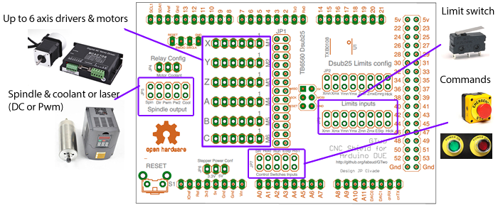
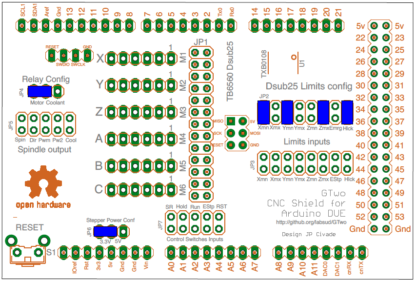

<h1 id="shield_gtwo_pour_arduino_due_tinyg_2">Shield GTwo pour Arduino DUE &amp; TinyG 2</h1>

Ce travail est la propri&eacute;t&eacute; de Jean-Philippe Civade (jp at civade dot com), et est mis sous licence <a href="licence-CC-By-NC 3.0.txt">Creative Common NonCommercial 3.0</a>

<a href="https://github.com/synthetos/TinyG">TinyG</a> est un syst&egrave;me de contr&ocirc;le &agrave; 6 axes d&eacute;velopp&eacute;  par Synthetos pour piloter CNC, d&eacute;coupe laser, etcc. Il a &eacute;t&eacute; con&ccedil;u pour fonctionner sur processeur Atmel ATxmega192.  C&#8217;est un syst&egrave;me complet (hard + soft).

Quelques caract&eacute;ristiques :

<ul>
<li>Gestion de 6 axes (XYZABC)</li>
<li>Planification de mouvement du 3e ordre </li>
<li>Affichage des &eacute;tats (caract&egrave;re &#8216;?&#8217;)</li>
<li>Gestion des protocoles de handshake XON/XOFF &amp; RTS/CTS sur la liaison s&eacute;rie via USB </li>
<li>Interface RESTful utilisant JSON</li>
</ul>

<a href="https://github.com/synthetos/g2">TinyG 2</a> est un portage de TinyG sur processeurs ARM, d&eacute;velopp&eacute; &eacute;galement par Synthetos, fonctionnant sur les processeurs ARM d&#8217;Atmel, comme celui utilis&eacute; sur la carte &eacute;conomique Arduino DUE. Ce portage peut &ecirc;tre configur&eacute; pour utilis&eacute; des shields GRBL standard (format Arduino UNO), mais malheureusement pas compl&egrave;tement. En effet, si il est possible de commander les moteurs pas &agrave; pas, tous les autres signaux sont rout&eacute;s sur les connecteurs d&#8217;extension de la l&#8217;Arduino mega, ce qui rend inaccessible les commandes manuelles, de fins ds courses, de commande de broche, etc.. 

C&#8217;est pr&eacute;cis&eacute;ment pour rendre accessible tous ces signaux qu&#8217;a &eacute;t&eacute; d&eacute;velopp&eacute; la shield GTwo: Permettre une utilisation facile de TinyG2 avec toutes les fonctionnalit&eacute;s mat&eacute;rielles disponibles. 

Cette shield peut &ecirc;tre utilis&eacute;e de 2 fa&ccedil;ons :

<ul>
<li>Raccord&eacute;e directement &agrave; une carte de puissance <a href="https://www.google.fr/search?q=tb6560+red&amp;num=20&amp;safe=off&amp;source=lnms&amp;tbm=isch&amp;sa=X&amp;ved=0ahUKEwinnOrSrarKAhXkpnIKHYe3DXwQ_AUIBygB&amp;biw=917&amp;bih=418">TB 6560 &#8220;Rouge&#8221;</a>. Cela permet la commande d&#8217;un maximum de 4 axes (X,Y,Z,A) et l&#8217;usage de 4 entr&eacute;es GPIO (exemple : Prise d&#8217;origine machine X,Y,Z et arr&ecirc;t d&#8217;urgence)</li>
<li>Raccord&eacute;e &agrave; des contr&ocirc;leurs d&#8217;axes ind&eacute;pendants (Leadshine, Gekko, etc.,) via des connecteurs &agrave; 6 broches. C&#8217;est dans ce cas jusqu&#8217;&agrave; 6 axes qui peuvent &ecirc;tre pilot&eacute;s (X,Y,Z,A,B,C). Dans ce cas, jusqu&#8217;&agrave; 6 swiches d&#8217;origine machine ou de fin de course peuvent &ecirc;tre raccord&eacute;es.</li>
</ul>

<h4 id="caracteristiques">Caracteristiques</h4>

<ul>
<li>Shield principalement passive, avec tous les connecteurs pour connecter broche traditionnelle ou PWM, arrosage, switches de prise d&#8217;origine et de limites, boutons de commande de l&#8217;ex&eacute;cution du programme, et jusqu&#8217;&agrave; 6 axes via des drivers externes.</li>
<li>Du fait que l&#8217;Arduino DUE n&#8217;est pas tol&eacute;rante au 5V (3.3V seulement&#8230;), un level shifter &agrave; 8 canaux est int&eacute;gr&eacute; pour permettre le raccordement des fins de courses en 5V (fins de courses actifs)</li>
<li>Toutes les autres entr&eacute;es (contr&ocirc;le de l&#8217;ex&eacute;cution du programme) sont pr&eacute;vues pour &ecirc;tre raccord&eacute;es au 0V via des interrupteurs et ne devraient jamais &ecirc;tre raccord&eacute;es &agrave; un 5V sous peine de destruction de l&#8217;Arduino DUE.</li>
</ul>

<h4 id="connexions">Connexions</h4>

<h5 id="lorsque_raccorde_une_carte_de_puissance_tb6560_8220rouge8221_">Lorsque raccord&eacute;e &agrave; une carte de puissance TB6560 &#8220;Rouge&#8221; :</h5>

<ul>
<li>JP1 : Raccordement &agrave; l&#8217;entr&eacute;e parall&egrave;le de la carte de puissance TB6560 &#8220;Rouge&#8221; via un cable r&eacute;alis&eacute; avec un connecteur HE10/26 points > Sub D 25 broches femelle. Si ce connecteur est utilis&eacute;, ne pas utiliser M1>M6</li>
<li>JP2 : Configuration des limites pour TB6560. Ne pas &eacute;quiper lors de l&#8217;utilisation de M1 > M6.</li>
<li>JP4 : Configuration du relais de la TB6560. Ne pas &eacute;quiper lors de l&#8217;utilisation de M1 > M6.</li>
</ul>

<h5 id="lorsque_raccorde_des_drivers_moteurs_externes_via_m1_m6">Lorsque raccord&eacute;e &agrave; des drivers moteurs externes via  M1 &agrave; M6</h5>

<ul>
<li>M1 > M6 : Permet de raccorder jusqu&#8217;&agrave; 6 drivers pour moteurs pas &agrave; pas ou servo moteurs (X/Y/Z/A/B/C). Si utilis&eacute;, ne pas utiliser JP1.</li>
<li>JP3 : Entr&eacute;es limites. Permet de raccorder les interrupteurs de d&eacute;tection de prise d&#8217;origine et de limite.(X-, X+, Y-, Y+, Z-, Z+), l&#8217;arr&ecirc;t d&#8217;urgence et l&#8217;interrupteur capot ouvert. Toutes les entr&eacute;es sont compatibles 5V.</li>
<li>JP6 : Configuration de l&#8217;alimentation envoy&eacute;e sur M1>M6 </li>
</ul>

Le brochage des connecteurs M1 &agrave; M6 est le suivant :
* Broche 1 : Pas (Step)
* Broche 2 : Direction (Dir)
* Broche 3 : Activation moteur (Enable, pour chaque moteur)
* Broche 4 : GND
* Broche 5 : Activation globale (Global Enable pour tous les moteurs simultan&eacute;ment)
* Broche 6 : VCC (3.3V ou 5V en fonction de JP6)

<h5 id="autres_connecteurs_">Autres connecteurs :</h5>

<ul>
<li>JP5 : Sortie broche et arrosage (3.3V). &#8220;Spindle&#8221; est pour le M/A broche, &#8220;dir&#8221; est pour le sens de rotation de la broche, &#8220;PWM&#8221; est pour raccorder une broche &agrave; contr&ocirc;le de vitesse en modulation de largeur d&#8217;impulsion, &#8220;PW2&#8221; est un PWM secodaaire  et &#8220;Cool&#8221; est pour raccorder la commande d&#8217;arrosage.</li>
<li>JP7 : Entr&eacute;es de contr&ocirc;le de l&#8217;ex&eacute;cution du programme. Y raccorder des poussoirs pour  le Reset Soft (SR), la suspension du programme, La reprise ou le d&eacute;marrage du programme (Run),l&#8217;arr&ecirc;t d&#8217;urgence (ESTP) ou le reset mat&eacute;riel de la carte (RST)</li>
</ul>

<h5 id="cavaliers_de_configuration">Cavaliers de configuration:</h5>

JP2 : (si utilisation de la TB6560 rouge) Doit &ecirc;tre &eacute;quip&eacute; de 4 cavaliers permettant le routage des switches de prise d&#8217;origine machine  X- ou X+ sur la broche Pin 10 du port parall&egrave;le, Y- ou Y+ &agrave; la broche 11 du port parall&egrave;le, Z-ou Z+ &agrave; la broche 12 du port parall&egrave;le, l&#8217;arr&ecirc;t d&#8217;urgence ou la protection capot ouvert &agrave; la broche 13 du port parall&egrave;le. 
JP4 : (si utilisation de la TB6560 rouge) Doit &ecirc;tre &eacute;quip&eacute; d&#8217;un cavalier permettant de router la commande moteur ou la commande d&#8217;arrosage sur le relais int&eacute;gr&eacute;.
JP6 : (si utilisation des connecteurs M1 &agrave; M6) Doit &ecirc;tre &eacute;quip&eacute; d&#8217;un cavalier permettant d&#8217;envoyer 3.3V ou 5V &agrave; la broche 6 des connecteurs M1 &agrave; M6.

<h5 id="documents_joints_">Documents joints :</h5>

<ul>
<li><a href="GTwoShieldSchematics.pdf">Sch&eactute;ma de principe</a></li>
<li><a href="partlist.txt">Nomenclature</a></li>
<li><a href="GTwoShield.zip">Archive Zip pour la fabrication</a></li>
<li><a href="imgs/DUE tinyG2 pinout 0.2.pdf">Brochage de la Due avec Tiny G2</a></li>
<li><a href="imgs/GTwoShieldAssembly.pdf">Assemblage</a></li>
<li><a href="imgs/GTwoShieldTop.png">Dessus</a></li>
<li><a href="imgs/GTwoShieldBottom.png">Dessous</a></li>
</ul>

<h5 id="exemple_de_configuration">Exemple de configuration:</h5>

Cette configuration correspond &agrave; une machine dont les swiches d&#8217;origine sont en bas &agrave; gauche et en haut du Z, pour une machine de CNC. GTtwo est dans ce cas raccord&eacute;e &agrave; une carte de puissance TB6560 &#8220;rouge&#8221; dont le relais est utilis&eacute; pour commander le M/A d&#8217;une broche  (moteur on /off = Commandes Gcode M3/M5). 
Les entr&eacute;es de la TB6560 sont respectivement raccord&eacute;es &agrave; Xmin, Ymin, ZMax et un bouton d&#8217;arr&ecirc;t d&#8217;urgence. Une alimentation 3.3V is rout&eacute;e vers la broche 6 des connecteurs M1 &agrave; M6 qui sont inutilis&eacute;s.

